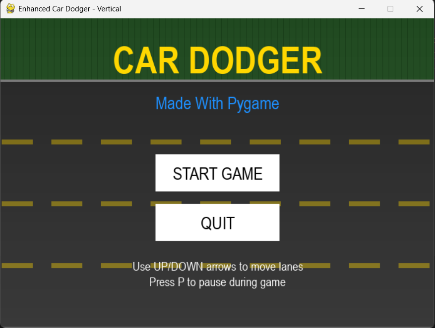
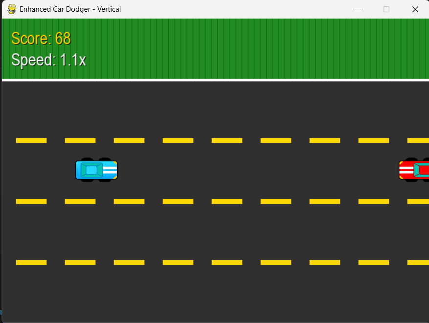
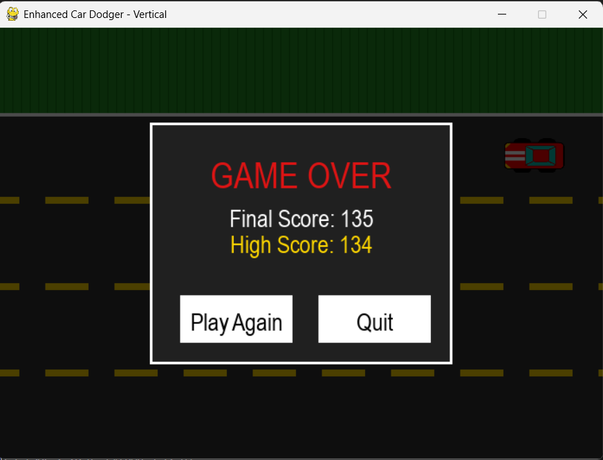

# 🚗 Car Dodger - Enhanced Vertical Racing Game

A fast-paced, vertical car dodging game built with Python and Pygame. Navigate through traffic, avoid collisions, and achieve the highest score possible!

## 🎮 Game Preview

### Screenshots


*Main menu with animated background*



*Intense gameplay action*



*Game over screen with score display*

## ✨ Features

### Core Gameplay
- **Vertical Lane Movement**: Use UP/DOWN arrow keys to switch between 4 lanes
- **Dynamic Difficulty**: Game speed increases as your score grows
- **Collision Detection**: Precise collision detection with explosion effects
- **Score System**: Points increase based on survival time and game speed
- **High Score Tracking**: Your best score is saved and displayed

### Visual Effects
- **Particle System**: Explosion effects on collision with colorful particles
- **Animated Road**: Moving lane dividers and grass texture for immersion
- **Smooth Animations**: 60 FPS gameplay with smooth transitions
- **Hover Effects**: Interactive buttons with glow effects
- **Gradient Backgrounds**: Beautiful color transitions in menus

### Audio Features
- **Background Music**: Continuous background soundtrack
- **Sound Effects**: 
  - Crash sounds on collision
  - Lane switching sounds
  - All audio with graceful fallback if files missing

### Game States
- **Main Menu**: Animated welcome screen with instructions
- **Gameplay**: Core dodging mechanics
- **Pause System**: Press 'P' to pause/resume
- **Game Over**: Score display with restart options

## 🎯 How to Play

1. **Movement**: Use `UP` and `DOWN` arrow keys to change lanes
2. **Objective**: Avoid colliding with oncoming cars
3. **Scoring**: Stay alive as long as possible - score increases with time
4. **Pause**: Press `P` during gameplay to pause/resume
5. **Speed**: Game gets faster as your score increases!

## 🛠️ Installation & Setup

### Prerequisites
- Python 3.7 or higher
- Pygame library

### Quick Start
```bash
# Clone the repository
git clone https://github.com/yourusername/car-dodger.git
cd car-dodger

# Install dependencies
pip install pygame

# Run the game
python car_dodger.py
```


## 🎨 Asset Requirements

### Audio Files
- **bg_music.mp3**: Background music (looping)
- **crash-sound-effect.mp3**: Collision sound effect
- **swap.mp3**: Lane switching sound

### Image Files
- **player_car.png**: Player car (40x70px recommended)
- **enemy_car.png**: Enemy car(40x70px recommended)

> **Note**: The game includes fallback graphics and will run without assets.

## ⚙️ Configuration

### Game Settings
```python
# Window dimensions
WIDTH, HEIGHT = 700, 500

# Game mechanics
enemy_speed = 6          # Base enemy speed
spawn_rate = 60          # Enemy spawn rate (frames)
lane_count = 4           # Number of driving lanes

# Visual settings
FPS = 60                 # Target frame rate
car_width, car_height = 80, 45  # Car dimensions
```

## 🔧 Technical Details

### Built With
- **Python 3.x**: Core programming language
- **Pygame**: Game development framework

### Key Components
- **Game Loop**: 60 FPS main game loop
- **State Management**: Menu, Playing, Paused, Game Over states
- **Collision System**: Rectangle-based collision detection
- **Particle Effects**: Custom particle system for explosions
- **Animation System**: Smooth transitions and effects

### Performance Features
- Efficient enemy cleanup (off-screen removal)
- Optimized particle rendering
- Smooth 60 FPS gameplay
- Memory-conscious asset loading

## 🎯 Gameplay Mechanics

### Difficulty Progression
- Base speed: 6 pixels per frame
- Speed multiplier: `1.0 + score / 1000`
- Spawn rate decreases as score increases
- Maximum challenge at higher scores

### Scoring System
- Points awarded continuously based on survival time
- Score multiplied by current game speed
- High score persistence between sessions

---

*Happy dodging! 🚗💨*
